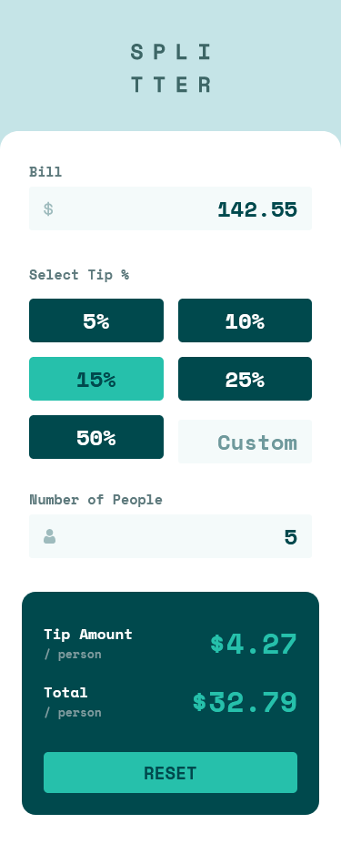

# Frontend Mentor - Tip calculator app solution

This is a solution to the [Tip calculator app challenge on Frontend Mentor](https://www.frontendmentor.io/challenges/tip-calculator-app-ugJNGbJUX). Frontend Mentor challenges help you improve your coding skills by building realistic projects. 

## Table of contents

- [Overview](#overview)
  
  - [The challenge](#the-challenge)
  - [Screenshot](#screenshot)
  - [Links](#links)
  
- [My process](#my-process)
  - [Built with](#built-with)
  
  

## Overview

### The challenge

Users should be able to:

- View the optimal layout for the app depending on their device's screen size
- See hover states for all interactive elements on the page
- Calculate the correct tip and total cost of the bill per person

## Screenshot

### Mobile Solution (375px width)

### Desktop Solution (1440px width)

### Links

- [Solution URL](https://github.com/AchrefFast/Frontend-Mentor--Tip-calculator-app-solution)
- [Live Site URL](https://achreffast.github.io/Frontend-Mentor--Tip-calculator-app-solution)

## My process

### Built with

- Semantic HTML5 markup

- SASS

- CSS Grid
  
- CSS Flexbox

- Mobile-first workflow

- JavaScript

## Author

- Frontend Mentor - [@AchrefFast](https://www.frontendmentor.io/profile/AchrefFast)
- GitHub - [@AchrefFast](https://github.com/AchrefFast)
